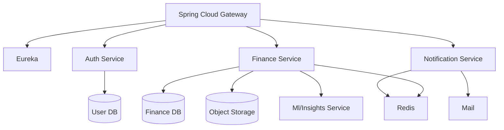
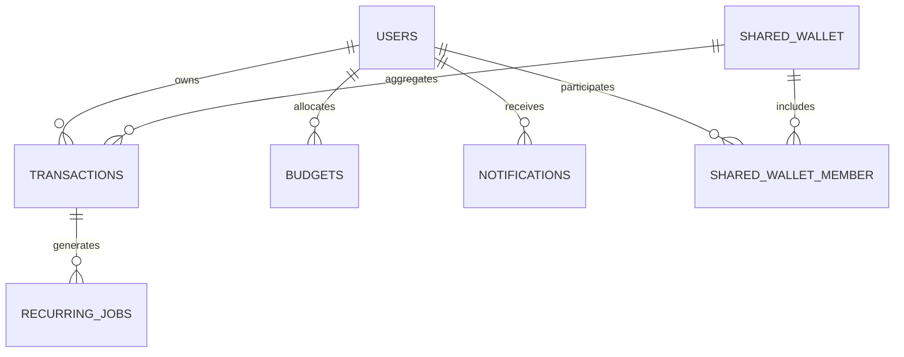

# FinTrack – Personal Finance & Budget Management System

## Table of Contents
- [1. Overview](#1-overview)
- [2. Technology Stack & Environment](#2-technology-stack--environment)
- [3. Local Development Setup](#3-local-development-setup)
- [4. Architecture](#4-architecture)
-	[4.1 High-Level Architecture](#41-high-level-architecture)
-	[4.2 Pro-Tier Microservice Topology (Optional)](#42-pro-tier-microservice-topology-optional)
-	[4.3 Repository Layer](#43-repository-layer)
-	[4.4 DTO Layer](#44-dto-layer)
- [5. Database Design](#5-database-design)
- [6. API Conventions](#6-api-conventions)
- [7. REST API Reference](#7-rest-api-reference)
	- [7.1 Authentication](#71-authentication)
	- [7.2 User Profile](#72-user-profile)
	- [7.3 Transactions](#73-transactions)
	- [7.4 Budgets](#74-budgets)
	- [7.5 Dashboard & Analytics](#75-dashboard--analytics)
	- [7.6 Recurring Transactions](#76-recurring-transactions-advanced)
	- [7.7 Files & Attachments](#77-files--attachments)
	- [7.8 Notifications](#78-notifications-advanced)
	- [7.9 Admin & Public Endpoints](#79-admin--public-endpoints-pro)
- [8. Background Jobs & Scheduling](#8-background-jobs--scheduling)
- [9. Security & Compliance](#9-security--compliance)
- [10. Testing Strategy](#10-testing-strategy)
- [11. Future Enhancements](#11-future-enhancements)
- [12. Appendix](#12-appendix)

---

## 1. Overview
FinTrack is a Spring Boot–based personal finance platform that centralizes budgeting, transaction tracking, analytics, and automation. The project is designed for local-first development and learning, yet it lays the groundwork for real-world deployment scenarios.

### Feature Tiers
- **Core (MVP)**: Authentication, role-based access, CRUD transactions, budgets, summaries, dashboards, transaction history.
- **Advanced**: Refresh tokens, 2FA, scheduled reports (PDF/Excel), file uploads, notifications, recurring transactions, caching.
- **Pro**: AI insights, recommendation engine, currency conversion, shared wallets, public analytics API (rate-limited), admin tooling, microservice-ready architecture.

---

## 2. Technology Stack & Environment

| Layer | Technology | Notes |
| --- | --- | --- |
| Backend | Spring Boot 3 (Web, Security, Data JPA, Validation), Spring Scheduler, Spring Mail | Primary API layer |
| Auth | JWT (jjwt), Spring Security, BCrypt | Access + refresh tokens, optional 2FA |
| Database | PostgreSQL (preferred) or MySQL | Local via Docker Compose; Liquibase/Flyway for migrations |
| Cache | Redis (optional) | Dashboard caching, token blacklisting |
| File Storage | Local filesystem (`/uploads`) with pluggable S3 adapter | Works offline by default |
| Messaging (optional) | Spring Events / RabbitMQ | For async notifications |
| Reports | Apache POI (Excel), iText or OpenPDF (PDF) | Advanced feature |
| Testing | JUnit 5, Mockito, Testcontainers | Unit + integration coverage |
| Docs | OpenAPI (springdoc), this README | Always up to date |

> **Local-first**: Every dependency has a local alternative (Docker Compose services or embedded implementations) so the application can be developed without cloud resources.

---

## 3. Local Development Setup

1. **Prerequisites**
	 - JDK 21+
	 - Docker & Docker Compose
	 - Node.js (optional for frontend companion apps)
2. **Clone & bootstrap**
	 ```bash
	 git clone https://github.com/Icarus-afk/fintrack.git
	 cd fintrack
	 ```
3. **Start infrastructure services**
	 ```bash
	 docker compose up -d
	 ```
	 Services launched: PostgreSQL (`5432`), Redis (`6379`), Mailpit (`8025/1025`).
4. **Configure environment**
	 - Copy `.env.example` to `.env` and adjust values.
	 - Key variables: `SPRING_DATASOURCE_URL`, `JWT_SECRET`, `FILE_UPLOAD_DIR`, `MAIL_HOST`.
5. **Run the application**
	 ```bash
	 ./mvnw spring-boot:run
	 ```
6. **Access tools**
	 - API docs: `http://localhost:8080/swagger-ui.html`
	 - Mailpit (capture emails): `http://localhost:8025`
	 - Uploaded files: stored under `./uploads`

---

## 4. Architecture

### 4.1 High-Level Architecture
```mermaid
graph TD
		FE[Frontend (Web/Mobile)] <--> API[Spring Boot REST API]
		API --> DB[(PostgreSQL)]
		API -. optional .-> Cache[Redis]
		API --> FS[Local File Storage]
		API --> Mail[SMTP (Mailpit)]
		API -. async .-> Jobs[Spring Scheduler/@Async]
```

### 4.2 Pro-Tier Microservice Topology (Optional)


### 4.3 Repository Layer
- Package: `com.lothbrok.fintrack.repository`
- Implements the persistence gateway by extending Spring Data JPA's `JpaRepository` for each aggregate.
- Enables declarative query generation (method-name derived queries) and transparent pagination support.

| Repository | Purpose | Highlighted Queries |
| --- | --- | --- |
| `UserRepository` | Manage user identities and lookup data. | `findByEmailIgnoreCase`, `existsByEmailIgnoreCase` |
| `TransactionRepository` | Fetch, paginate, and aggregate personal and shared-wallet transactions. | `findByUserIdAndEventDateBetween`, `findBySharedWalletId`, `countByUserIdAndEventDateBetween` |
| `BudgetRepository` | Handle monthly/category budgets and prevent duplicates. | `findByUserIdAndMonth`, `existsByUserIdAndMonthAndCategory` |
| `NotificationRepository` | Deliver unread notifications and recent activity. | `findByUserIdAndReadFalse`, `findTop20ByUserIdOrderByCreatedAtDesc` |
| `RecurringJobRepository` | Track upcoming recurring executions. | `findByActiveTrueAndNextRunAtBefore`, `findByUserIdAndTemplateTransactionId` |
| `SharedWalletRepository` | Locate shared wallets owned by a user. | `findByOwnerId`, `existsByOwnerIdAndNameIgnoreCase` |
| `SharedWalletMemberRepository` | Manage membership and permissions. | `findByWalletIdAndMemberId`, `findByMemberId` |

> **Next layer:** Services orchestrate domain rules using these repositories, keeping controllers thin and REST-focused.

### 4.4 DTO Layer
- Root package: `com.lothbrok.fintrack.dto`
- Shapes HTTP contracts via immutable Java records, ensuring entities stay internal to the persistence layer.
- Key modules:
	- `dto.common`: Implements the standardized response envelope (`ApiResponse`, `ErrorDetail`, `ResponseMeta`, `PaginationMeta`).
	- Feature packages (`auth`, `user`, `transaction`, `budget`, `notification`, `recurring`, `sharedwallet`): Request/response payloads tuned for each controller.
	- `dto.mapper`: Stateless utilities that translate between JPA entities and DTOs, computing derived fields such as budget utilization and shared wallet balances.
- Further reading: [`docs/dto-overview.md`](docs/dto-overview.md)

---

## 5. Database Design

### 5.1 Entity-Relationship Diagram (Core)


### 5.2 Tables (Core)

#### `users`
| Column | Type | Constraints | Notes |
| --- | --- | --- | --- |
| `id` | UUID | PK | Generated via `UUIDv7()`
| `email` | VARCHAR(255) | Unique, indexed | Lower-cased
| `password_hash` | VARCHAR(255) | Not null | BCrypt encoded
| `full_name` | VARCHAR(150) | Not null | |
| `role` | ENUM(`USER`,`ADMIN`) | Default `USER` | |
| `avatar_url` | VARCHAR(255) | Nullable | Local path
| `two_factor_secret` | VARCHAR(32) | Nullable | For optional TOTP
| `created_at` | TIMESTAMP | Default now | |
| `updated_at` | TIMESTAMP | On update | |

#### `transactions`
| Column | Type | Constraints | Notes |
| --- | --- | --- | --- |
| `id` | UUID | PK |
| `user_id` | UUID | FK → `users.id` | Index `idx_transaction_user_date`
| `wallet_id` | UUID | FK → `shared_wallet.id`, nullable | Pro tier
| `title` | VARCHAR(120) | Not null |
| `amount` | NUMERIC(14,2) | Not null | Positive values
| `currency` | CHAR(3) | Default `USD` | ISO 4217
| `category` | VARCHAR(60) | Not null | Controlled vocabulary
| `type` | ENUM(`INCOME`,`EXPENSE`) | Not null |
| `event_date` | DATE | Not null |
| `note` | TEXT | Nullable |
| `attachment_url` | VARCHAR(255) | Nullable |
| `created_at` | TIMESTAMP | Default now |

#### `budgets`
| Column | Type | Constraints | Notes |
| --- | --- | --- | --- |
| `id` | UUID | PK |
| `user_id` | UUID | FK → `users.id` | |
| `month` | CHAR(7) | Not null | Format `YYYY-MM`
| `category` | VARCHAR(60) | Nullable | Null = overall budget
| `amount` | NUMERIC(14,2) | Not null |
| `alert_threshold` | NUMERIC(3,2) | Default `0.8` | 80% alert by default
| `created_at` | TIMESTAMP | Default now |

#### `notifications`
| Column | Type | Constraints | Notes |
| --- | --- | --- | --- |
| `id` | UUID | PK |
| `user_id` | UUID | FK → `users.id` | |
| `type` | ENUM(`BUDGET_LIMIT`,`RECURRING_REMINDER`,`SECURITY`) | |
| `title` | VARCHAR(120) | |
| `message` | TEXT | |
| `metadata` | JSONB | Additional context |
| `is_read` | BOOLEAN | Default `false` |
| `created_at` | TIMESTAMP | Default now |

#### `recurring_jobs` (Advanced)
| Column | Type | Constraints | Notes |
| --- | --- | --- | --- |
| `id` | UUID | PK |
| `user_id` | UUID | FK → `users.id` |
| `template_transaction_id` | UUID | FK → `transactions.id` |
| `frequency` | ENUM(`DAILY`,`WEEKLY`,`MONTHLY`,`YEARLY`) | |
| `next_run_at` | TIMESTAMP | Indexed |
| `last_run_at` | TIMESTAMP | Nullable |
| `active` | BOOLEAN | Default `true` |

> **Migrations**: Versioned with Flyway/Liquibase; all enumerations stored as PostgreSQL enums for integrity. Sample migration scripts are kept under `src/main/resources/db/migration`.

### 5.3 Reference Data
- **Categories**: Seed table `transaction_categories` for consistent reporting.
- **Currencies**: `currencies` table for exchange rates (Pro).
- **Shared Wallets**: `shared_wallet` + join table `shared_wallet_member` with roles and share ratios.

### 5.4 Indexing & Performance
- B-tree indexes on (`user_id`, `event_date`) for transaction history.
- Partial indexes for unread notifications.
- Materialized view `mv_monthly_summary` (optional) refreshed nightly for dashboard performance.

---

## 6. API Conventions

- **Base URL**: `http://localhost:8080/api/v1`
- **Media type**: `application/json` (multipart for uploads)
- **Authentication**: `Authorization: Bearer <access_token>`
- **Standard Response Envelope**:
	```json
	{
		"success": true,
		"data": {},
		"error": null,
		"meta": {
			"timestamp": "2025-10-21T12:00:00Z",
			"requestId": "b2e1...",
			"pagination": null
		}
	}
	```
- **Error Response**:
	```json
	{
		"success": false,
		"data": null,
		"error": {
			"code": "AUTH_INVALID_CREDENTIALS",
			"message": "Email or password is incorrect",
			"details": null
		},
		"meta": {
			"timestamp": "2025-10-21T12:00:00Z",
			"requestId": "b2e1..."
		}
	}
	```
- **Pagination**: `page`, `size` query params; `meta.pagination` returns `page`, `size`, `totalPages`, `totalElements`.
- **Sorting**: `sort=<field>,asc|desc`. Default: `event_date,desc` for transactions.
- **Filtering**: Resource-specific query params (e.g., `from`, `to`, `category`, `type`).
- **Validation Errors**: `error.code = "VALIDATION_FAILED"`; `error.details` lists field violations.
- **Versioning**: URL prefix `/api/v1`; future versions will reuse envelope.

---

## 7. REST API Reference

> All successful responses follow the standardized envelope. Only the `data` and `meta.pagination` payload differs per endpoint.

### 7.1 Authentication

| Method | Path | Description |
| --- | --- | --- |
| `POST` | `/api/v1/auth/register` | Create a new user |
| `POST` | `/api/v1/auth/login` | Authenticate user, return tokens |
| `POST` | `/api/v1/auth/refresh` | Refresh access token |
| `POST` | `/api/v1/auth/logout` | Invalidate refresh token |
| `POST` | `/api/v1/auth/forgot-password` | Issue password reset email |
| `POST` | `/api/v1/auth/reset-password` | Complete password reset |
| `POST` | `/api/v1/auth/2fa/verify` | Verify optional 2FA code |

**Register – sample**
```http
POST /api/v1/auth/register
Content-Type: application/json

{
	"fullName": "Alice Example",
	"email": "alice@example.com",
	"password": "P@ssw0rd123"
}
```

**201 Created**
```json
{
	"success": true,
	"data": {
		"id": "018f7f1f-5b6b-724e-b966-8e8c090e6d12",
		"fullName": "Alice Example",
		"email": "alice@example.com",
		"role": "USER",
		"createdAt": "2025-10-21T12:00:00Z"
	},
	"error": null,
	"meta": {
		"timestamp": "2025-10-21T12:00:00Z",
		"requestId": "reg-3ac3"
	}
}
```

**Login – sample**
```json
{
	"email": "alice@example.com",
	"password": "P@ssw0rd123"
}
```

**200 OK**
```json
{
	"success": true,
	"data": {
		"accessToken": "eyJhbGciOiJIUzI1NiIsInR5cCI6IkpXVCJ9...",
		"refreshToken": "b5c81bb1-...",
		"expiresIn": 900
	},
	"error": null,
	"meta": {
		"timestamp": "2025-10-21T12:05:00Z",
		"requestId": "auth-14c2"
	}
}
```

### 7.2 User Profile

| Method | Path | Description |
| --- | --- | --- |
| `GET` | `/api/v1/users/me` | Fetch current user profile |
| `PUT` | `/api/v1/users/me` | Update profile fields |
| `PUT` | `/api/v1/users/me/password` | Change password |
| `POST` | `/api/v1/users/me/avatar` | Upload avatar (multipart) |

**GET /users/me – sample response**
```json
{
	"success": true,
	"data": {
		"id": "018f7f1f-...",
		"fullName": "Alice Example",
		"email": "alice@example.com",
		"role": "USER",
		"avatarUrl": "/uploads/avatars/018f7f1f.png",
		"twoFactorEnabled": true
	},
	"error": null,
	"meta": {
		"timestamp": "2025-10-21T12:06:00Z",
		"requestId": "usr-813f"
	}
}
```

### 7.3 Transactions

| Method | Path | Description |
| --- | --- | --- |
| `GET` | `/api/v1/transactions` | List transactions with filters |
| `POST` | `/api/v1/transactions` | Create a transaction |
| `GET` | `/api/v1/transactions/{id}` | Retrieve single transaction |
| `PUT` | `/api/v1/transactions/{id}` | Update transaction |
| `DELETE` | `/api/v1/transactions/{id}` | Remove transaction |

**Query Parameters**
- `type=INCOME|EXPENSE`
- `category=Food`
- `from=2025-10-01`
- `to=2025-10-31`
- `minAmount`, `maxAmount`
- `walletId` (Pro)

**GET /transactions – sample response**
```json
{
	"success": true,
	"data": [
		{
			"id": "0190c7d1-...",
			"title": "Groceries",
			"amount": 82.45,
			"currency": "USD",
			"category": "Food",
			"type": "EXPENSE",
			"eventDate": "2025-10-19",
			"note": null,
			"attachmentUrl": null,
			"walletId": null
		}
	],
	"error": null,
	"meta": {
		"timestamp": "2025-10-21T12:15:00Z",
		"requestId": "txn-52f3",
		"pagination": {
			"page": 0,
			"size": 20,
			"totalPages": 3,
			"totalElements": 48
		}
	}
}
```

**POST /transactions – request**
```json
{
	"title": "Salary",
	"amount": 3200.00,
	"currency": "USD",
	"category": "Salary",
	"type": "INCOME",
	"eventDate": "2025-10-01",
	"note": "October payroll"
}
```

**201 Created – response**
```json
{
	"success": true,
	"data": {
		"id": "0190c8aa-...",
		"title": "Salary",
		"amount": 3200.0,
		"currency": "USD",
		"category": "Salary",
		"type": "INCOME",
		"eventDate": "2025-10-01",
		"note": "October payroll",
		"createdAt": "2025-10-21T12:18:00Z"
	},
	"error": null,
	"meta": {
		"timestamp": "2025-10-21T12:18:00Z",
		"requestId": "txn-8931"
	}
}
```

### 7.4 Budgets

| Method | Path | Description |
| --- | --- | --- |
| `GET` | `/api/v1/budgets` | List budgets (optional month/category filters) |
| `POST` | `/api/v1/budgets` | Create budget |
| `PUT` | `/api/v1/budgets/{id}` | Update amount/threshold |
| `DELETE` | `/api/v1/budgets/{id}` | Delete budget |

**GET /budgets – response**
```json
{
	"success": true,
	"data": [
		{
			"id": "0190c9e1-...",
			"month": "2025-10",
			"category": "Food",
			"amount": 400.0,
			"spent": 310.75,
			"percentageUsed": 0.78,
			"alertThreshold": 0.8
		}
	],
	"error": null,
	"meta": {
		"timestamp": "2025-10-21T12:21:00Z",
		"requestId": "bdg-4410"
	}
}
```

**Alert**: When `percentageUsed >= alertThreshold`, the notification service issues an email and in-app notification.

### 7.5 Dashboard & Analytics

| Method | Path | Description |
| --- | --- | --- |
| `GET` | `/api/v1/dashboard/summary` | Totals for income, expense, balance |
| `GET` | `/api/v1/dashboard/trends` | Time-series data for charts |
| `GET` | `/api/v1/dashboard/category-distribution` | Pie chart data |

**GET /dashboard/summary – response**
```json
{
	"success": true,
	"data": {
		"totalIncome": 8200.0,
		"totalExpense": 5420.5,
		"netBalance": 2779.5,
		"period": {
			"from": "2025-10-01",
			"to": "2025-10-31"
		}
	},
	"error": null,
	"meta": {
		"timestamp": "2025-10-21T12:25:00Z",
		"requestId": "dash-912a"
	}
}
```

### 7.6 Recurring Transactions (Advanced)

| Method | Path | Description |
| --- | --- | --- |
| `GET` | `/api/v1/recurring` | List recurring transaction templates |
| `POST` | `/api/v1/recurring` | Create schedule |
| `PUT` | `/api/v1/recurring/{id}` | Update schedule |
| `DELETE` | `/api/v1/recurring/{id}` | Deactivate schedule |

Scheduler uses cron expressions mapped from frequency. Generated transactions reuse the same API envelope and fire notifications on success/failure.

### 7.7 Files & Attachments

| Method | Path | Description |
| --- | --- | --- |
| `POST` | `/api/v1/files` | Upload receipt/avatar (multipart) |
| `DELETE` | `/api/v1/files/{id}` | Delete attachment |

**Upload – response**
```json
{
	"success": true,
	"data": {
		"fileName": "receipt-0190ca4f.png",
		"url": "/uploads/receipts/receipt-0190ca4f.png",
		"size": 48213,
		"contentType": "image/png"
	},
	"error": null,
	"meta": {
		"timestamp": "2025-10-21T12:28:00Z",
		"requestId": "file-7740"
	}
}
```

### 7.8 Notifications (Advanced)

| Method | Path | Description |
| --- | --- | --- |
| `GET` | `/api/v1/notifications` | List notifications (filter by `isRead`) |
| `POST` | `/api/v1/notifications/mark-read` | Bulk mark read |

### 7.9 Admin & Public Endpoints (Pro)

- **Admin**: `/api/v1/admin/users`, `/api/v1/admin/transactions`, `/api/v1/admin/reports`
- **Public Analytics API**: `/api/v1/public/stats/categories` (rate-limited via Bucket4J + Redis) returning anonymized averages.

---

## 8. Background Jobs & Scheduling

- **Monthly Report Job**: Generates PDF/Excel using iText & Apache POI, emails via Mailpit. Runs on the 1st day of month 02:00 local.
- **Recurring Transaction Processor**: Runs every hour to evaluate `recurring_jobs.next_run_at`.
- **Budget Alert Monitor**: Runs daily to compare spend vs thresholds.
- **Cache Warmers**: Rebuilds dashboard caches every 15 minutes.

---

## 9. Security & Compliance

- JWT access tokens (15 min) + refresh tokens (30 days) stored server-side (Redis) for revocation.
- BCrypt password hashing with strength 12.
- Optional TOTP-based 2FA with QR enrollment.
- Input validation via `jakarta.validation` annotations; sanitization for file uploads.
- Audit logging: `aud_events` table captures logins, password resets, admin actions.
- Rate limiting for login & public APIs.
- GDPR readiness: right to be forgotten (soft delete + data purge job).

---

## 10. Testing Strategy

- **Unit Tests**: Service layer logic, validation rules.
- **Integration Tests**: Use Testcontainers for PostgreSQL/Redis to validate repositories and controllers.
- **Contract Tests**: Spring REST Docs/OpenAPI snapshot to ensure schema stability.
- **Performance Smoke Tests**: Gatling/JMeter scripts for dashboard endpoints.

---

## 11. Future Enhancements

- AI-driven insights microservice (Python/Java) via REST/gRPC.
- Multi-currency ledger with daily FX synchronization.
- Shared wallet settlements and bill-splitting workflows.
- Mobile push notifications via Firebase/APNs.
- Infrastructure-as-code (Terraform) for cloud deployment.

---

## 12. Appendix

### 12.1 Sample `.env.example`
```dotenv
SPRING_PROFILES_ACTIVE=local
SPRING_DATASOURCE_URL=jdbc:postgresql://localhost:5432/fintrack
SPRING_DATASOURCE_USERNAME=fintrack
SPRING_DATASOURCE_PASSWORD=fintrack
SPRING_JPA_HIBERNATE_DDL_AUTO=validate
JWT_SECRET=change-me
JWT_ACCESS_TOKEN_TTL=900
JWT_REFRESH_TOKEN_TTL=2592000
FILE_UPLOAD_DIR=./uploads
MAIL_HOST=localhost
MAIL_PORT=1025
MAIL_FROM=no-reply@fintrack.local
REDIS_HOST=localhost
REDIS_PORT=6379
```

### 12.2 Error Code Catalog (excerpt)
| Code | HTTP | Description |
| --- | --- | --- |
| `AUTH_INVALID_CREDENTIALS` | 401 | Email/password mismatch |
| `AUTH_TOKEN_EXPIRED` | 401 | Access token expired |
| `AUTH_2FA_REQUIRED` | 403 | User enabled 2FA but code missing/invalid |
| `USER_DUPLICATE_EMAIL` | 400 | Email already registered |
| `TXN_NOT_FOUND` | 404 | Transaction does not exist |
| `BUDGET_THRESHOLD_EXCEEDED` | 409 | Operation would exceed budget |
| `FILE_UNSUPPORTED_TYPE` | 415 | Only image/pdf allowed |

### 12.3 Reporting Templates
- Templates stored under `src/main/resources/reports`.
- Use Thymeleaf for HTML-to-PDF pipeline (optional alternative to iText).

---

This document serves as the canonical reference for FinTrack's architecture, database schema, and API behavior. Keep it updated as features evolve.
